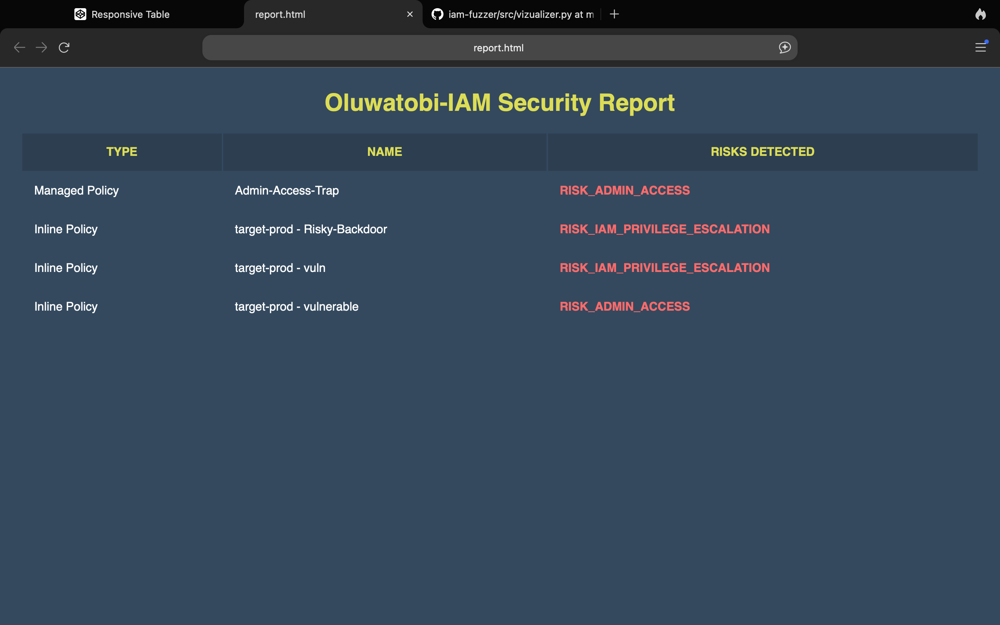

# Log 005: The Data Pipeline & Visualizer
**Date:** 2026-01-13

## 1. Objective
Transform the tool from a temporary CLI utility into a persistent reporting engine. My goal was to separate the **Data Collection** (Backend) from the **Data Presentation** (Frontend).

## 2. The Architecture Change
I moved away from simple `print()` statements to a decoupled **Producer-Consumer** model.

* **The Producer (Collector):** No longer just prints to screen(N one likes black screen anyway). It now serializes findings into a standard data format (`findings.json`).
* **The Consumer (Visualizer):** A separate script that reads the data and renders it for humans (`report.html`).

_So this allows the scanning logic to run on a server (CI/CD) while the report can be viewed anywhere (Browser), mimicking real-world Enterprise tools like **Splunk**(Which I will be using for my other projects)._

## 3. The Tech Stack
* **Serialization:** Used Python's `json` library to dump list dictionaries.
* **Frontend:** Built a raw HTML/CSS template using **Responsive Web Design (RWD)** principles(_Copied from codepen.io_).
* **Integration:** Used Python `f-strings` to dynamically inject risk data into HTML table rows.

## 4. Key Features
* **Data Persistence:** Findings are saved to disk, preventing data loss if the terminal is closed.
* **Visual Hierarchy:** Implemented CSS styling to highlight "Risks" in **Red** (`#ff6b6b`) and Headers in **Yellow** (`#dd5`), making the report scan-able for executives.
* **Mobile Compatibility:** Used `data-th` attributes and CSS media queries to ensure the report remains readable on smaller screens.

## 5. Outcome
Successfully generated `report.html` containing accurate findings from `target-prod`.
* **Proof of Concept:** Validated that the Visualizer correctly parses the JSON output from the Collector.
**_Screenshot_**:
